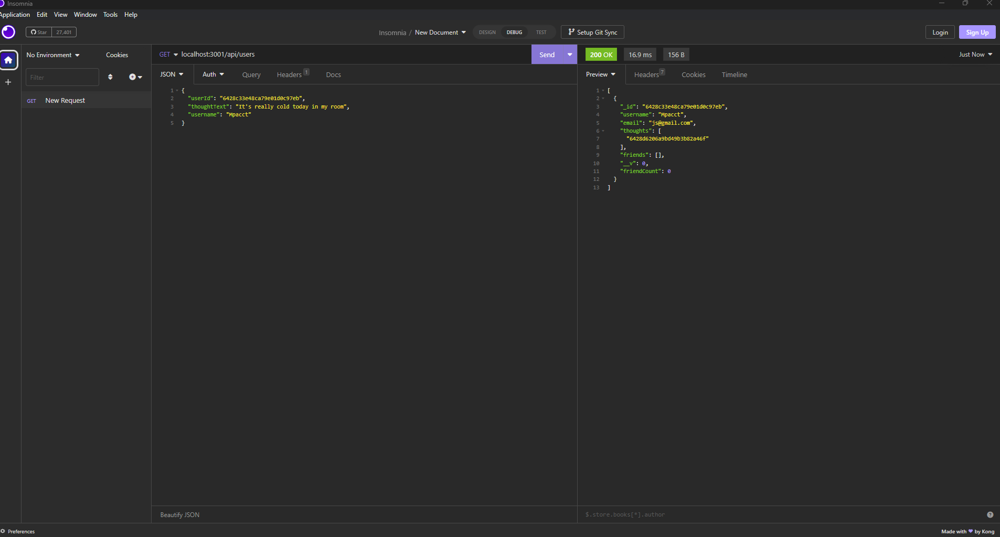

# Social Networking API 
  
## Description

This projects shows the backend development of a social networking API.  This creates multiple collections using NOSQL and connects and references users, their thoughts, and reactions, similarly to facebook likes and posts

## Table of Contents

- [Installation](#installation)
- [Usage](#usage)
- [License](#license)
- [Contributing](#contributing)
- [Tests](#tests)
- [Questions](#questions)

## Installation

run "npm i" in the terminal

## Usage

run "npm start" in the terminal

[WalkthroughVideo](https://watch.screencastify.com/v/s3sjWtCd0f48hc5MQ5eq)

## License

This project is not licensed.

## Contributing

Nick Rosales, github.com/nickrosales

## Tests

None

## Questions

Github username: [Mpacct](https://www.github.com/Mpacct)

Email: marcuspacc@gmail.com

